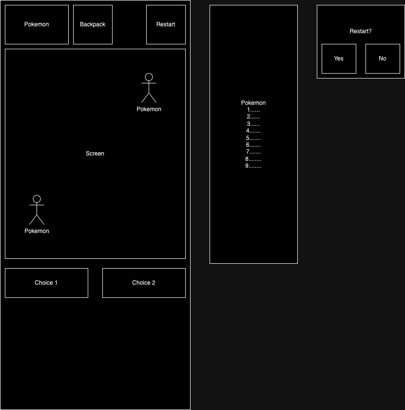

# Pokemon: Rivals!

## Description
Pokémon: Rivals! is a browser-based game that puts you into a series of Pokémon encounters. With simple A/B decision-making mechanics, you'll be able to catch and battle randomly generated Pokémon from the vast Pokémon world, using real data pulled from PokéAPI.

## How To Get Started
Press ENTER on the keyboard or click "Press Start" with your mouse to get started.

Follow the instructions presented on the screen to select and name your first Pokémon. Enter into encounters with rivals or wild Pokémon. Against rivals you can either forfeit or fight. The former will remove you from the fight while the latter will move you through a battle loop that runs your Pokémon's stats (pulled from PokéAPI) against the enemy Pokémon's stats. With random number generation, you'll see either your Pokémon's HP or the enemy Pokémon's HP decrease with each iteration of the battle loop. Each time you'll be prompted to either continue fighting or to forfeit.

Against Wild Pokémon, you also have the option to catch the Pokémon, which will be a random chance determined by the enemy Pokémon's current HP and SPD stat.

See how many battles you can win and what Pokémon you can find!

## Stretch Goals
Multiple fights, save score, pokemon by rarity, save and swap pokemon, catch chance determined by SPD

## Wireframe

### Credits
PokéAPI is owned by Paul Hallet, Tim Malone and Alessandro Pezzé. Alongside them other core maintainers include Charles Marttinen and Sargun Vohra.

Pokémon is owned by Nintendo.

Pokémon: Rivals is made and maintained by Molly Parente.

Rivals! title screen made by ChatGPT.